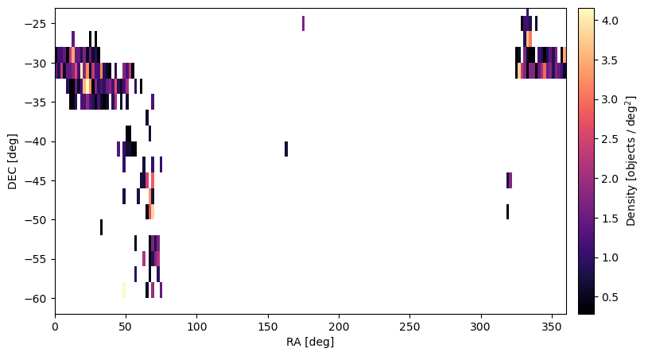

# 1. Sub-survey overview

## Sub-survey title: GRIT@4MOST: Galaxies in Transition — Influence of Group Environment
Contact person: Erik V. R. Lima
Contact email address: erikv.usp@gmail.com

## 1.1 Source of target catalogue selection

Targets were selected using imaging from the S-PLUS survey (DR5; Lima et al., in prep.) and group identifications from the 2PIGG catalogue (Eke et al. 2004) and S-PLUS/eROSITA group catalogue (Doubrawa et al., in prep.).
All S-PLUS data are publicly available at: https://splus.cloud
The GRIT@4MOST sample includes a total of 738 galaxies, which represents the complete set of transition systems selected for spectroscopic follow-up with 4MOST LRS.
These targets were defined from S-PLUS photometric data and structural parameters derived using the MorphoPLUS pipeline, based on GALFITM, which performs multi-band Sérsic fitting across the 12 S-PLUS filters.
All catalogue products are stored in the GRIT@4MOST repository.

## 1.2 Target selection overview

Transition galaxies (TGs) were selected as:

Red systems: (u−r)>2.3, ensuring they are quiescent or recently quenched.

Low-Sérsic systems: Sérsic index in r-band, nr<2.5, corresponding to disc-like or transitional morphologies.

Structural parameters were derived from S-PLUS images using MorphoPLUS.
The initial sample included all galaxies in S-PLUS overlapping with 2PIGG/S-PLUS-eROSITA groups. We applied quality flags and photometric limits (r < 19.5 mag) to ensure reliable morphology and color measurements, as well as good signal-to-noise in the spectral calculator.
No stochastic down-sampling was applied; only physically motivated cuts based good signal to noise and morphology were used.

## 1.3 Target coordinates, proper motion, and parallaxes

Coordinates correspond to Right Ascension and Declination in the J2000 reference frame, as provided by the S-PLUS astrometric solution.
The S-PLUS astrometry is tied to the Gaia DR3 reference frame, ensuring sub-arcsecond accuracy.
For extragalactic sources, proper motions and parallaxes are set to zero (PMRA = 0, PMDEC = 0, PARALLAX = 0), as expected for distant galaxies.
The positional epoch corresponds to J2000.

## 1.4 Target photometry

Photometry is measured directly from S-PLUS imaging using SExtractor aperture magnitudes.
All magnitudes in the catalogue are observed values (not corrected for Galactic extinction).
The photometric system is AB, and the S-PLUS broadband filters (g, r, i, z) are SDSS-like, while the u filter follows the Javalambre (J-PLUS) system.

## 1.5 Redshifts

The redshifts in the GRIT@4MOST catalogue come from two independent sources, depending on the parent group catalogue:

For 2PIGG groups (Eke et al. 2004):
The redshifts are spectroscopic, obtained from the 2dF Galaxy Redshift Survey (2dFGRS; Colless et al. 2001).
Typical uncertainties are Δz ≈ 0.0003.

For S-PLUS/eROSITA groups (Doubrawa et al., in prep.):
The redshifts are photometric, derived using the machine-learning method of Lima et al. (2022) applied to S-PLUS DR5 photometry cross-matched with unWISE data.
This approach combines a Bayesian Neural Network and a Mixture Density Network to predict photometric redshifts, achieving a scatter σₙₘₐd ≈ 0.023, a normalized bias of −0.001, and an outlier fraction of 0.64% for galaxies with 16 < r_auto < 21 mag.

## 1.6 Reddening

Foreground reddening is estimated using the Schlegel, Finkbeiner & Davis (1998) maps, adopting E(B–V) values at the target position via bilinear interpolation.
The reddening values are stored in the REDDENING column of the FITS catalogue.
Photometric magnitudes are not corrected for this effect within the table.

## 1.7 Spectral templates

No spectral templates were used for the target selection.
The GRIT@4MOST catalogue is purely photometric and structural, based on S-PLUS imaging and Sérsic parameters derived with MorphoPLUS.
No spectral energy distribution fitting or model templates were applied at this stage.
The only model-based quantity included in the catalogue is the foreground reddening correction (E(B–V)), estimated from the Schlegel, Finkbeiner & Davis (1998) dust maps.

## 1.8 Known connections to other sub-surveys

There are no known connections or overlaps with other 4MOST sub-surveys or supplementary target programmes.

## 1.9 Additional information

The GRIT@4MOST catalogue (4MOST_targets_LRS_GRIT.fits) follows the VIS-MAN-4MOST-47110-1720-0001 format (version 2.6) and contains 738 galaxies selected for spectroscopic follow-up with the 4MOST LRS.
All units and metadata have been validated using the fitsvalidator tool.

The calibration columns (CAL_MAG_*) are intentionally filled with 0.0 placeholders, as no external photometric calibration was applied.
The EXTENT_PARAMETER values were computed from the effective radius (Re) in arcseconds, multiplied by the S-PLUS pixel scale (0.55 arcsec/pix).
No additional quality cuts or down-sampling were applied beyond the morphological and photometric criteria described above.

# Figures

  

Distribution of right ascension (RA) for the selected transition galaxies.

  

Distribution of r-band magnitudes from S-PLUS (3-arcsec aperture).

  

Sky density distribution of transition galaxies in equatorial coordinates.

  

Contours of the effective radius as a function of the S´ersic index in the r−band. The distribution of each parameter is shown in the margin plot.
